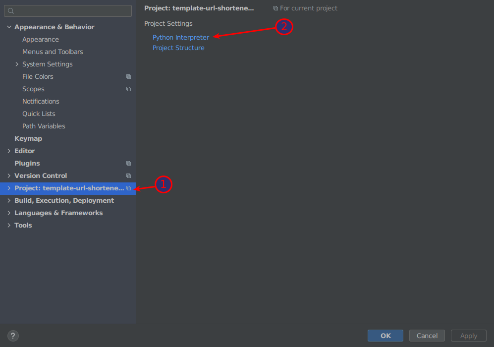
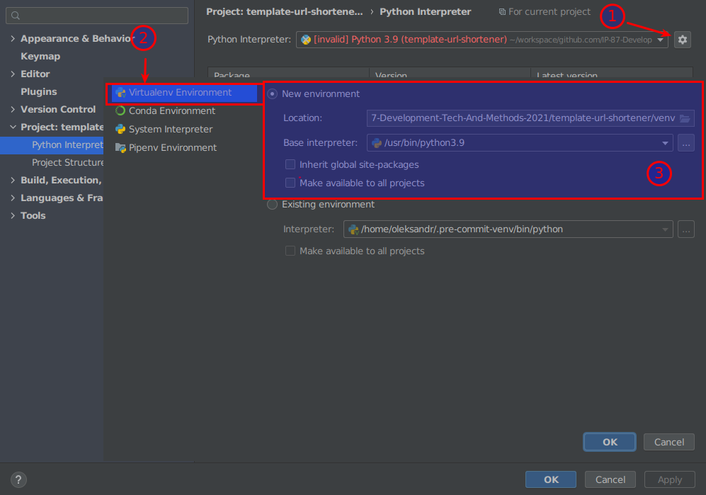
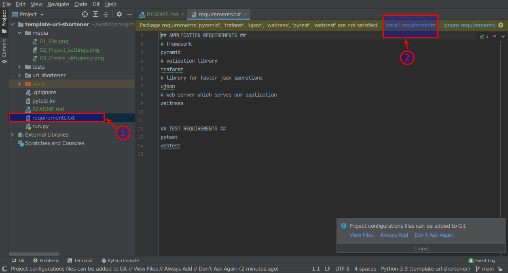
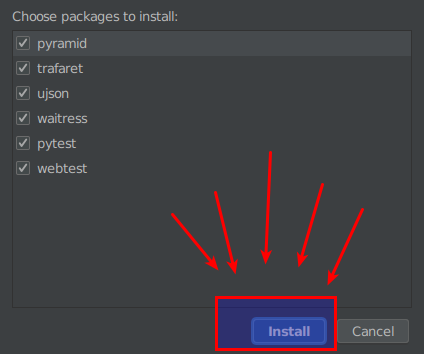
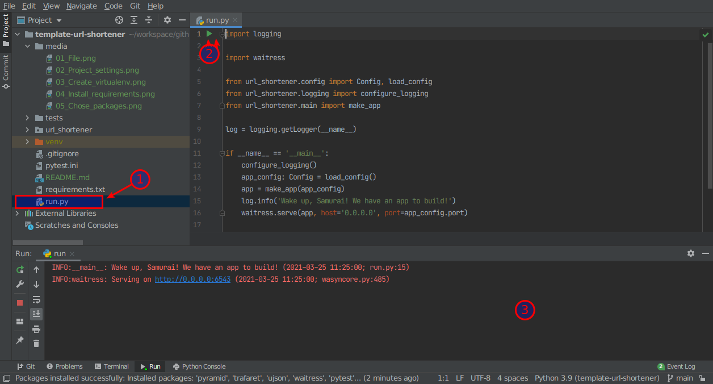

# 🧪 URLshortened  — URL Shortener 🧪

This is a template project for "Modern methods and technologies of software development" course labs. Use it to create
your own repository and fulfill/rewrite this document (at least, replace everything in `{...}`).

## Team

- Kaan Karay kaankaray99@gmail.com — [@kaankaray](https://github.com/kaankaray) 
- Zakaria Boughanbouz youyiniou@hotmail.com - [@Zakaria98-dz](https://github.com/Zakaria98-dz)
- Ali Osman Kul aosmankul97@gmail.com - [@al0s](https://github.com/al0s)

## Design document

The [design document](https://docs.google.com/document/d/1hGnRlAZmTvFqzdfUvD8AxyWIbSxNFAhaFtawrsWnir0/edit?usp=sharing)
describes architecture and implementation details of this project.

### System structure

There are five modules:

- `url_shortener.auth` **authentication module** — handles user authentication and access control
- `url_shortener.dto` — data transfer objects
- `url_shortener.logic` **business logic** - logic of URL shortening
- `url_shortener.storage` — a key-value persistence storage (please, pay attention that you should implement it by
  yourself. It means that it is not allowed to use data bases, another key-value storages implementation, etc)
- `url_shortener.views` **REST API** — a module that provides a REST API.
  [Pyramid](https://docs.pylonsproject.org/projects/pyramid/en/latest/index.html)
  framework is already added to project dependencies

## Environment prerequisites

### Python

This is a Python project, so you will need an environment with installed
[python interpreter](https://www.python.org/) of version 3.6 or higher. For installation, you can use the official
downloads:

- https://www.python.org/downloads/

### IDE

Use [PyCharm Edu](https://www.jetbrains.com/pycharm-edu/) as IDE

### REST API interaction

You can use the following tools to work with the REST API

- [Postman](https://www.postman.com/downloads/)
- [Insomnia](https://insomnia.rest/) — kinda simpler alternative to Postman

## Running the project

1. Open project in PyCharm Edu
2. Navigate to `File` -> `Settings`
   
3. Go to `Project: <project name>` -> `Python Interpreter`
   
4. Create virtual environment by clicking Gear button first, then selecting `Add`. Chose `Virtualenv environment` in the
   new window and chose the interpreter and location for the new virtual environment
   . Press `OK` to create new virtualenv environment.
5. Open `requirements.txt` file, and then click `Install requirements` link on the banner
   
6. Make sure all checkboxes are selected and click `Install`. Then wait for a while for packages to be installed.
   
7. Open `run.py` file, then click on the green triangle at the top of the file. Observe application logs in the console
   window
   
8. Visit http://0.0.0.0:6543/public in your browser and observe `{"available_for": "everyone"}` text

## Endpoints

1. `GET` `/public` --- public URL which always returns `{"available_for": "everyone"}` JSON
2. `GET` `/resource/{some key}` --- this endpoint is protected. In order to visit it you should
   pass `Authorization: Bearer <some token>` header with your request. Currently authorization is not implemented
   properly so any token will be valid. If keys is not available, `404 Not found` error will be shown to user
3. `PUT` `/resource/{some key}`, JSON `{"value": "some value here"}` --- this endpoint is protected. In order to visit
   it you should pass `Authorization: Bearer <some token>` header with your request. This request will store the
   value `some value here` under the `some key`, and saved value will be available for retrieval later using
   the `GET /resource/{some key}` endpoint. Will return `409 conflict` if key `some key` is already used.
